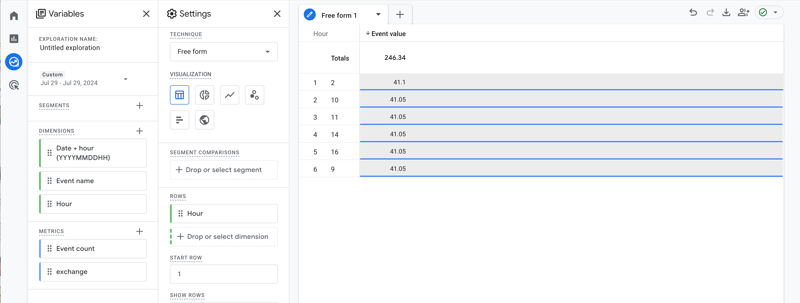

## See the Google Analytics

1. Create your own property (GA4) https://analytics.google.com/analytics/web
2. Run the application that has a scheduled event that sends events about uah/usd exchange rate to GA
3. Observe the results in GA UI. For example you can observe a table with 1 usd = X uah currency exchange rate per hour within a day 

